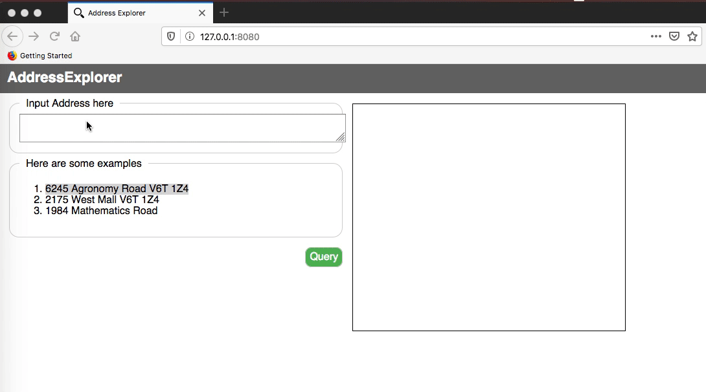

# cpsc310-geolocation-ui

## Goal
Given an address of a UBC building, display its location on a map

## Set up
`git clone` this repository

`yarn install` to install dependencies

`yarn start` to start a http server serving the files, then in a browser go to http://127.0.0.1:8080 to access the UI

## Activity
Implement the javascript files under the `public` folder:
* `query-index.js`
* `query-builder.js`
* `query-sender.js`

Specific TODOs can be found in each file.

## APIs we will use
* Finding geolocation of building: `http://cs310.students.cs.ubc.ca:11316/api/v1/project_team<TEAM NUMBER>/<ADDRESS>`

* Display location on map: [openstreetmap API](https://wiki.openstreetmap.org/wiki/OpenLinkMap#Embed_map_in_another_website)
